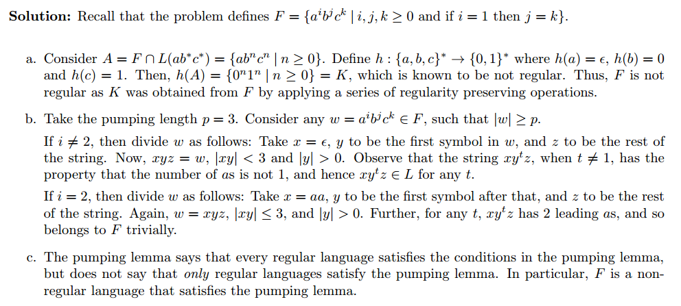

## Chap1 

### 1.31
- [ref](http://www.public.asu.edu/~ccolbou/src/355hw2s11sol.pdf)

=======

### 1.32
- [ref](https://courses.engr.illinois.edu/cs373/fa2010/Problem_Sets/hw1sol.pdf)

=======

### 1.40
- [ref](http://www.eecs.berkeley.edu/~luca/cs172-07/solutions/sol2.pdf)

=====
### 1.41
- [ref](http://www.cs.nthu.edu.tw/~wkhon/assignments/assign1ans.pdf)

=====
### 1.42
- [ref](http://www.cs.nthu.edu.tw/~wkhon/assignments/assign1ans.pdf)

=====

### 1.46
- [ref](http://www.public.asu.edu/~ccolbou/src/355hw2s11sol.pdf)

=====

### 1.48
- [ref](http://www.math-cs.gordon.edu/courses/cps220/Notes/nonregular_languages.pdf)

=====

### 1.49
- [ref](http://www.enriqueareyan.com/sites/default/files/math/B501%20Theory%20of%20Computing/Resources/MidTermExampleTest.pdf)

### 1.54
- [ref](https://courses.engr.illinois.edu/cs373/fa2010/Problem_Sets/hw4sol.pdf)

