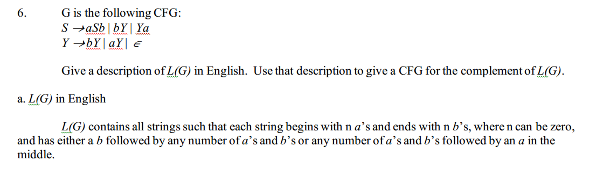
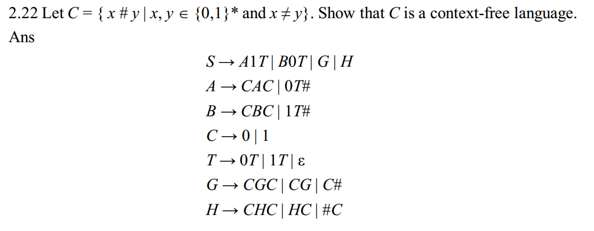
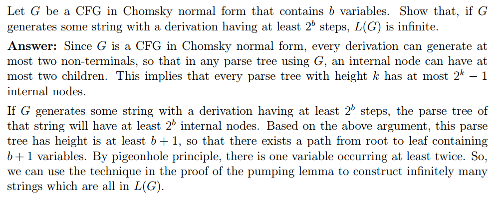
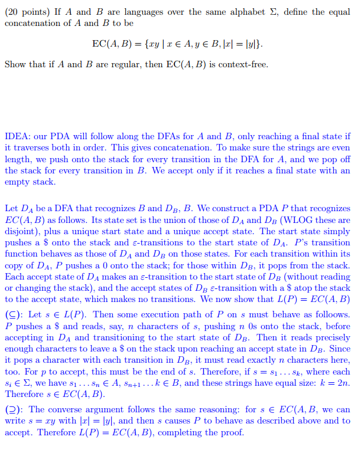

## Chap 2

### 2.18
- check book page-135

### 2.19
- [ref](https://www.google.com/url?sa=t&rct=j&q=&esrc=s&source=web&cd=1&ved=0CCAQFjAA&url=http%3A%2F%2Fboole.stanford.edu%2Fpub%2FCS154.doc&ei=GygLVbCYM4SxggSXj4S4BQ&usg=AFQjCNHKHPReycZZzVRPFlEYK8nTIkB6rQ&sig2=nnmYoi1KwuE8EmV4ASz0Xg&bvm=bv.88528373,d.eXY&cad=rjt)

### 2.20
- [explain why B cannot be CFL](http://cs.stackexchange.com/questions/20090/closure-of-cfl-against-right-quotient-with-regular-languages)
- [ref](http://www.docstoc.com/docs/39330607/Homework-2-CS530-Introduction-to-Computational-Complexity)

### 2.21
- [ref](http://staffwww.dcs.shef.ac.uk/people/J.Marshall/alc/studyguides/Selected_Solutions_2.pdf)

### 2.22
- [ref](https://www.google.com/url?sa=t&rct=j&q=&esrc=s&source=web&cd=2&ved=0CCQQFjAB&url=http%3A%2F%2Fis.cs.nthu.edu.tw%2Fcourse%2F2008Fall%2FCT537100%2Fsol%2Fhw_sol_part.doc&ei=UjALVf-lCMHYgwTbm4LYDQ&usg=AFQjCNHA2EOWyXjUQ6chZQhqIZWhEjZ_Mw&sig2=p_Ap8r7vzOtyeEXFZVRh4Q&bvm=bv.88528373,d.eXY&cad=rjt)

### 2.23
- [clear explain](http://kuldeepfreek.blogspot.com/2013/10/223-let-d-xy-xy-01-x-y-but-x-y-show.html)

### 2.24
- [ref](http://homepage.cs.uiowa.edu/~hzhang/c135/HW2ans.pdf)

### 2.25
- [short explain](http://kuldeepfreek.blogspot.com/2013/10/sipser-225-cfls-are-closed-under-suffixa.html)
- [ref](http://www.public.asu.edu/~ccolbou/src/355hw4s09sol.pdf)

### 2.35
- [ref](http://www.cs.nthu.edu.tw/~wkhon/assignments/assign2ans.pdf)

### 2.44
- [ref](http://www.cs.cmu.edu/~lblum/flac/Solutions/Sol4.pdf)

