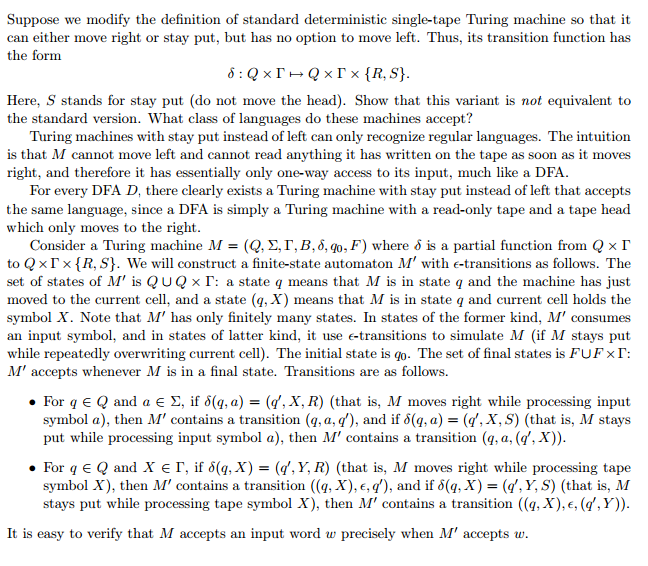
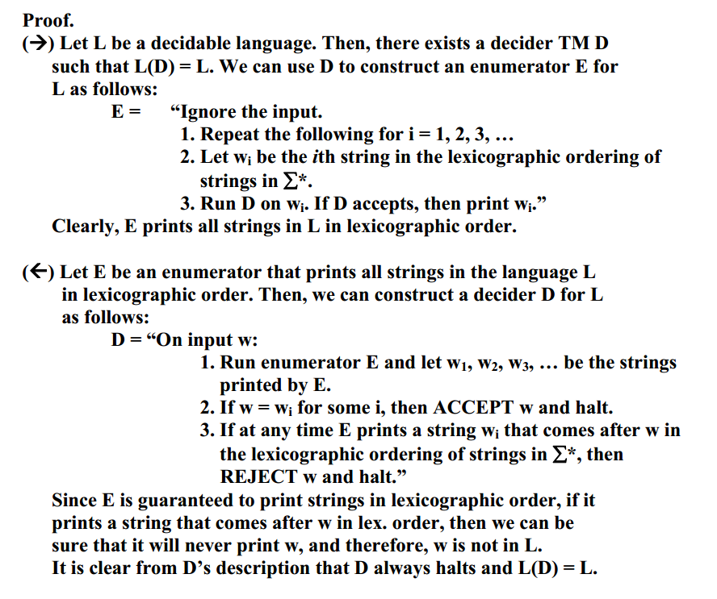
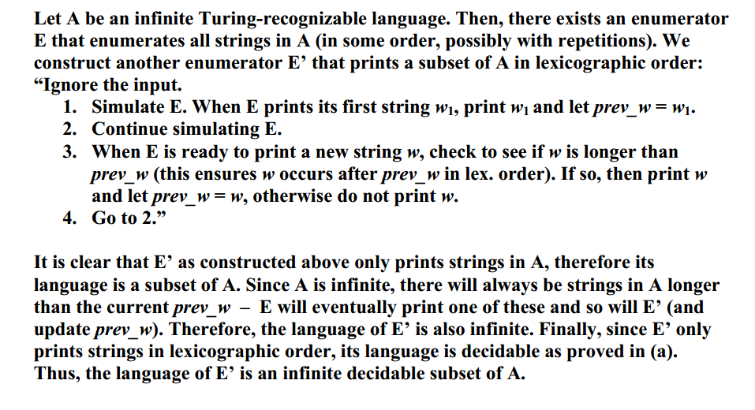

## Chap 3 Answer

### 3.12
- [ref](http://soltys.cs.csuci.edu/homepage/cs2mj3-f10/t5.pdf)

### 3.13
- [ref](ftp://ftp.cis.upenn.edu/pub/cis511/public_html/Spring08/sol4.pdf)

### 3.14
- [ref](http://cs.stackexchange.com/questions/21460/prove-queue-automaton-is-equivalent-to-turing-machine)

### 3.15, 3.16
- [ref](http://homepage.cs.uiowa.edu/~sriram/131/spring07/homework1Solution.pdf)

### 3.18
- [ref](http://courses.cs.washington.edu/courses/cse322/10sp/final-solutions.pdf)

### 3.19
- [ref](http://courses.cs.washington.edu/courses/cse322/10sp/final-solutions.pdf)

