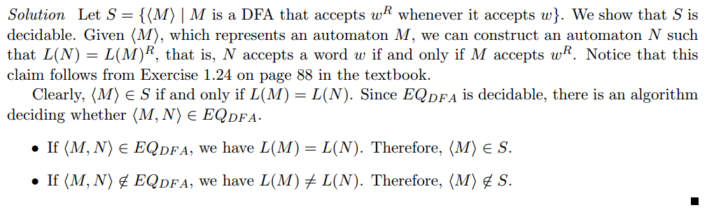
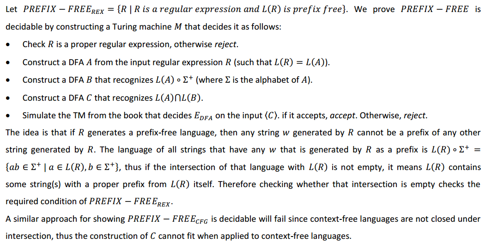

## Chap 4

- [ref1](http://www.stolerman.net/studies/cs525/cs525_ch04_preparation.pdf): contains problem 

---

### 4.2, 4.3
- [ref](http://www.cse.buffalo.edu/courses/cse396/content/hwSol-7.pdf)

### 4.4
- [ref](http://cseweb.ucsd.edu/~mihir/cse105/ss3.pdf)

### 4.10
- [ref](http://www.public.asu.edu/~ccolbou/src/355hw6s09sol.pdf)
- [shorter explain](http://www.stolerman.net/studies/cs525/cs525_ch04_preparation.pdf)

### 4.12
- [ref](http://www.stolerman.net/studies/cs525/cs525_ch04_preparation.pdf)

### 4.15
- [ref](http://www.math-cs.gordon.edu/courses/cps220/Notes/example4.15.pdf)

### 4.16
- [ref](http://www.stolerman.net/studies/cs525/cs525_ch04_preparation.pdf)
- why enumerate up to n*m?

### 4.18
- [ref](http://www.stolerman.net/studies/cs525/cs525_ch04_preparation.pdf)

### 4.19
- [ref](http://www.cs.bu.edu/fac/hwxi/academic/courses/eces-670/HANDOUTS/solution8.pdf)

=================

### 4.20
- [ref](http://www.stolerman.net/studies/cs525/cs525_ch04_preparation.pdf)

================

### 4.21
- check book page 188.

### 4.22
- [ref](http://www.stolerman.net/studies/cs525/cs525_ch04_preparation.pdf)
- interesting

### 4.24
- [ref](http://www.cs.nthu.edu.tw/~wkhon/toc07-assignments/assign3ans.pdf)

### 4.25
- [ref](http://www.cs.nthu.edu.tw/~wkhon/assignments/assign3ans.pdf)

### 4.26
- [ref](http://www.stolerman.net/studies/cs525/cs525_ch04_preparation.pdf)

### 4.27
- [ref](http://www.stolerman.net/studies/cs525/cs525_ch04_preparation.pdf)

### 4.28
- [ref](https://www.cs.auckland.ac.nz/~cristian/mfcsdir/cris/2009/andre/A2.pdf)
