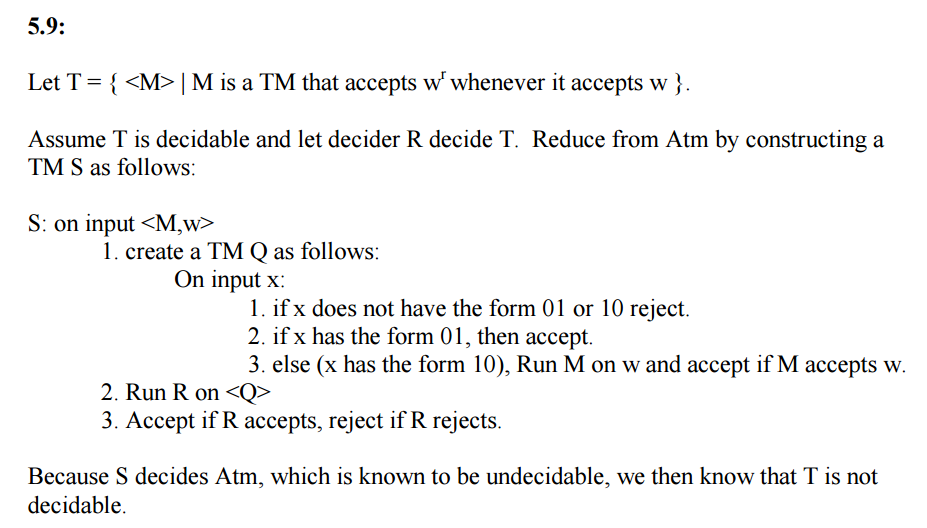
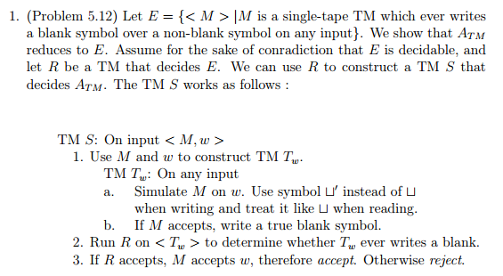
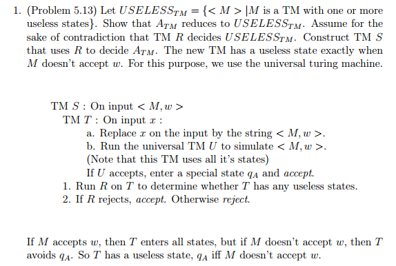
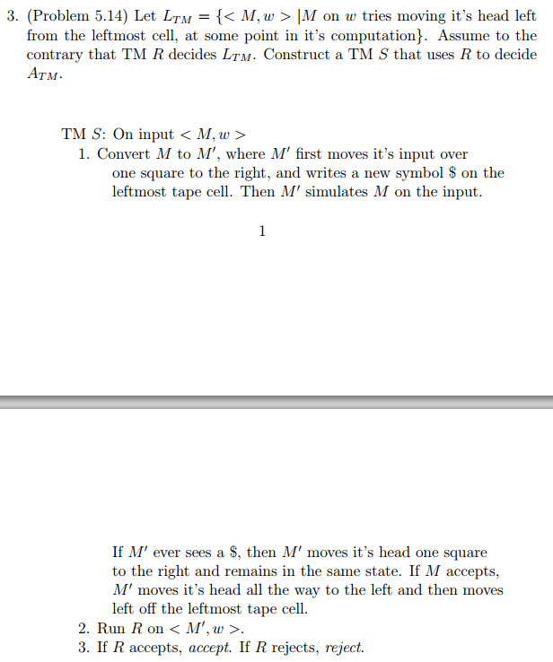
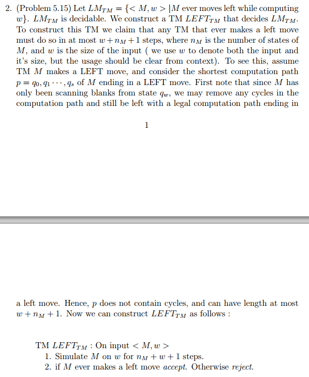
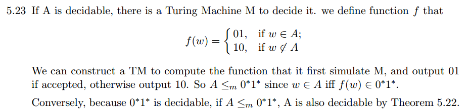
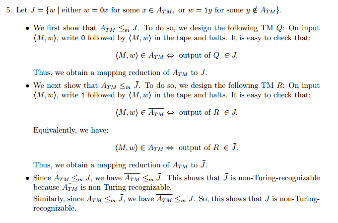
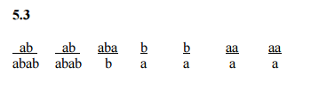
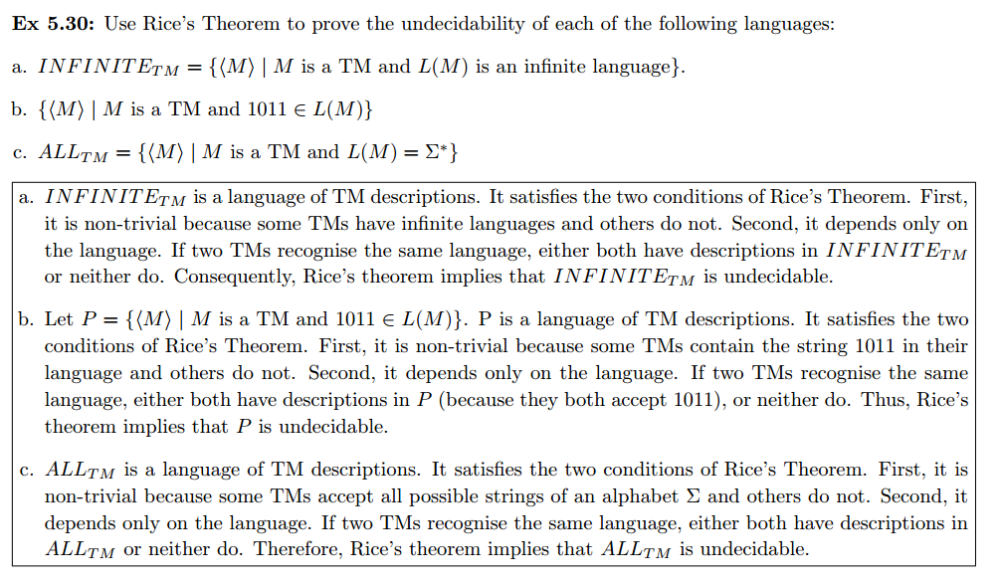

## Chap 5 Answer

### Homework
- 5.9, 5.10, 5.11, 5.12, 5.13, 5.14, 5.15, 5.23, 5.24

### 5.9
- [ref](http://cseweb.ucsd.edu/classes/sp06/cse105/homework8.pdf)
- [better one](https://web.njit.edu/~marvin/cs341/hw/hwsoln09.pdf)

-----

### 5.12
- [ref](http://homepage.cs.uiowa.edu/~sriram/131/spring07/problemSession2.pdf)

-----

### 5.13
- [ref](http://homepage.cs.uiowa.edu/~sriram/131/spring07/homework2Solution.pdf)

-----

### 5.14
- [ref](http://homepage.cs.uiowa.edu/~sriram/131/spring07/problemSession2.pdf)

-----

### 5.15
- [ref](http://homepage.cs.uiowa.edu/~sriram/131/spring07/homework2Solution.pdf)

-----

### 5.23
- [ref](http://people.cs.nctu.edu.tw/~sctsai/fc/hw/hw5_sol.pdf)

-----

### 5.24
- [ref](http://www.cs.nthu.edu.tw/~wkhon/toc07-assignments/assign4ans.pdf)

-----

### Non-Homework
### 5.3
- [ref](http://cseweb.ucsd.edu/classes/sp06/cse105/homework8.pdf)

-----

### 5.30
- [ref](https://www.cs.auckland.ac.nz/~cristian/mfcsdir/cris/2010/tutorials/tut08_Solutions.pdf)

-----
