## Chap 5 Answer

### Homework
- 5.9, 5.10, 5.11, 5.12, 5.13, 5.14, 5.15, 5.23, 5.24

### 5.9
- [ref](http://cseweb.ucsd.edu/classes/sp06/cse105/homework8.pdf)
- [better one](https://web.njit.edu/~marvin/cs341/hw/hwsoln09.pdf)

-----

### 5.12
- [ref](http://homepage.cs.uiowa.edu/~sriram/131/spring07/problemSession2.pdf)

-----

### 5.13
- [ref](http://homepage.cs.uiowa.edu/~sriram/131/spring07/homework2Solution.pdf)

-----

### 5.14
- [ref](http://homepage.cs.uiowa.edu/~sriram/131/spring07/problemSession2.pdf)

-----

### 5.15
- [ref](http://homepage.cs.uiowa.edu/~sriram/131/spring07/homework2Solution.pdf)

-----

### 5.23
- [ref](http://people.cs.nctu.edu.tw/~sctsai/fc/hw/hw5_sol.pdf)

-----

### 5.24
- [ref](http://www.cs.nthu.edu.tw/~wkhon/toc07-assignments/assign4ans.pdf)

-----

-----

### Non-Homework
### 5.1
- [ref](http://www.cs.uml.edu/~giam/91.304/Spring06/tf11.solns.pdf)

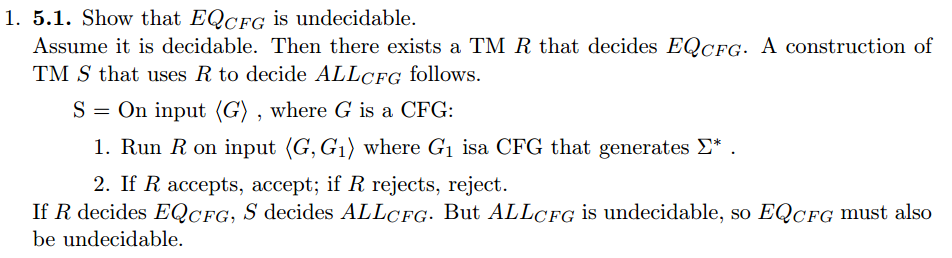

-----

### 5.2
- [ref](http://www.cs.uml.edu/~giam/91.304/Spring06/tf11.solns.pdf)

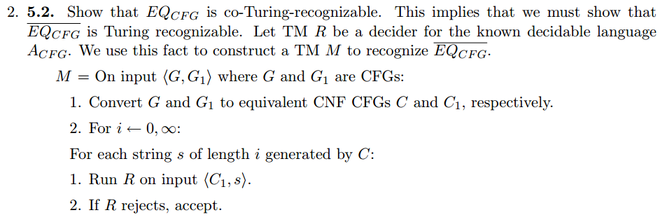

-----

### 5.3
- [ref](http://cseweb.ucsd.edu/classes/sp06/cse105/homework8.pdf)

-----

### 5.4
- [ref](http://people.cs.nctu.edu.tw/~sctsai/fc/hw/hw5_sol.pdf)

-----

### 5.16
- [ref](http://www.cs.nthu.edu.tw/~wkhon/assignments/assign4ans.pdf)

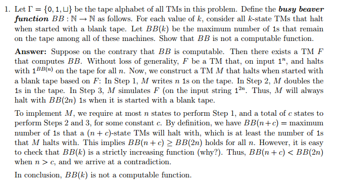

-----

### 5.17
- [ref](http://cseweb.ucsd.edu/classes/sp06/cse105/homework8.pdf)

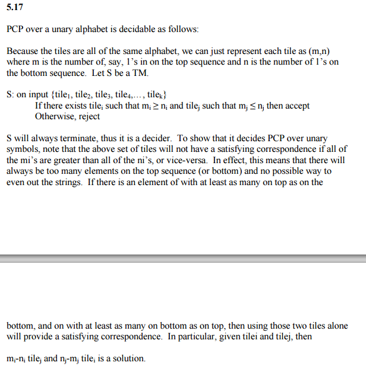

-----

### 5.18
- [ref](https://courses.engr.illinois.edu/cs373/fa2010/Problem_Sets/hw8sol.pdf)

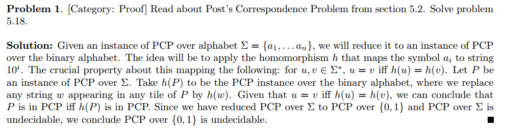

-----

### 5.19
- [ref](http://people.cs.aau.dk/~srba/courses/tutorials-CC-10/t6-sol.pdf)

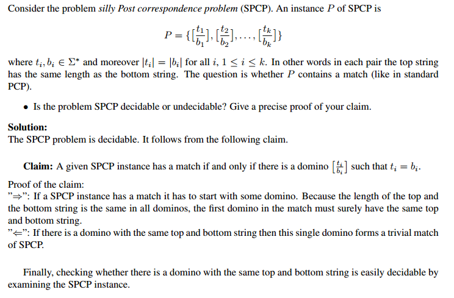

-----

### 5.20
- [no precise](http://web.cs.swarthmore.edu/~adanner/cs46/s14/hw07.pdf)

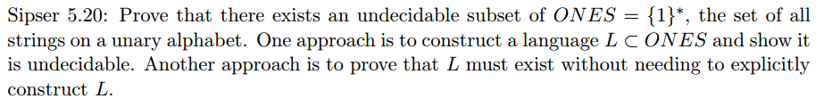

- [clear!](http://cobweb.cs.uga.edu/~shelby/classes/2670-fall-05/HW9Soln.pdf)

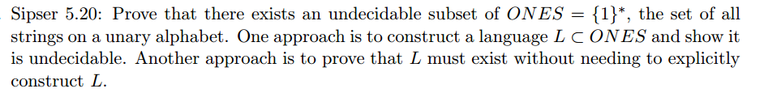

-----

### 5.21
- [ref](http://www.ugrad.cs.ubc.ca/~cs421/hw/10/a.pdf)

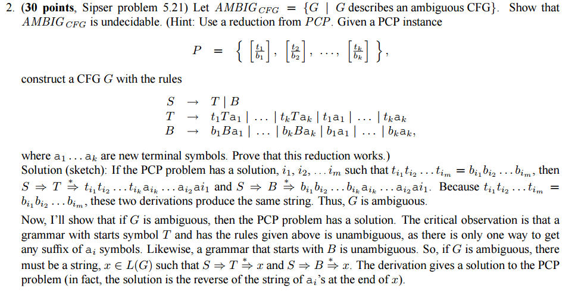

-----

### 5.22
- [ref](https://courses.engr.illinois.edu/cs373/fa2010/Problem_Sets/hw8sol.pdf)

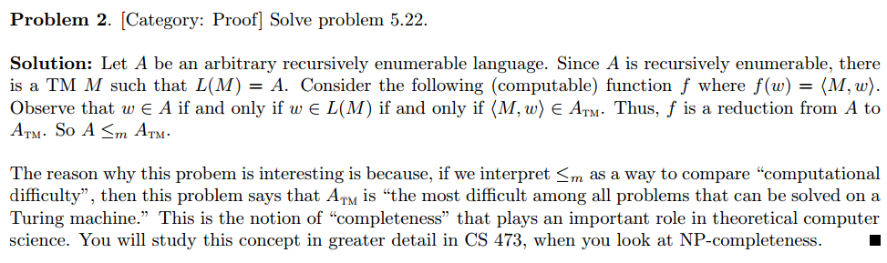

-----

### 5.25
- Any Turing-recognizable but not co-Turing-recognizable language works (or vice versa), such as $A_{TM}$.

### 5.26
- [ref](http://www.cs.nthu.edu.tw/~wkhon/assignments/assign4ans.pdf)

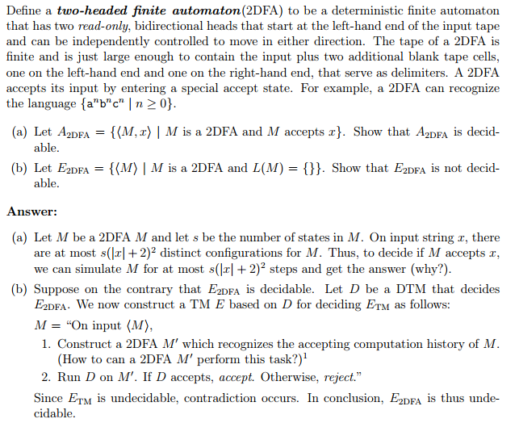

----

### 5.29
- [ref](https://www.cs.auckland.ac.nz/~cristian/mfcsdir/cris/2010/tutorials/tut08_Solutions.pdf)

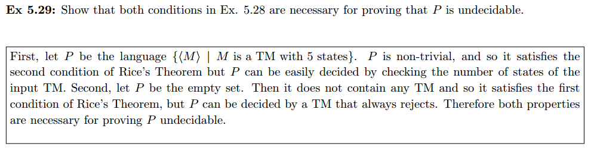

-----

### 5.30
- [ref](https://www.cs.auckland.ac.nz/~cristian/mfcsdir/cris/2010/tutorials/tut08_Solutions.pdf)

-----

### 5.31
- [ref](http://www.ugrad.cs.ubc.ca/~cs421/hw/10/a.pdf)

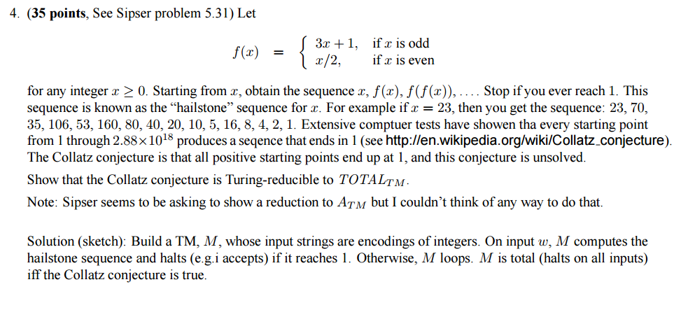

-----

### 5.33
- [ref](http://homepage.cs.uiowa.edu/~sriram/131/spring07/homework2Solution.pdf)

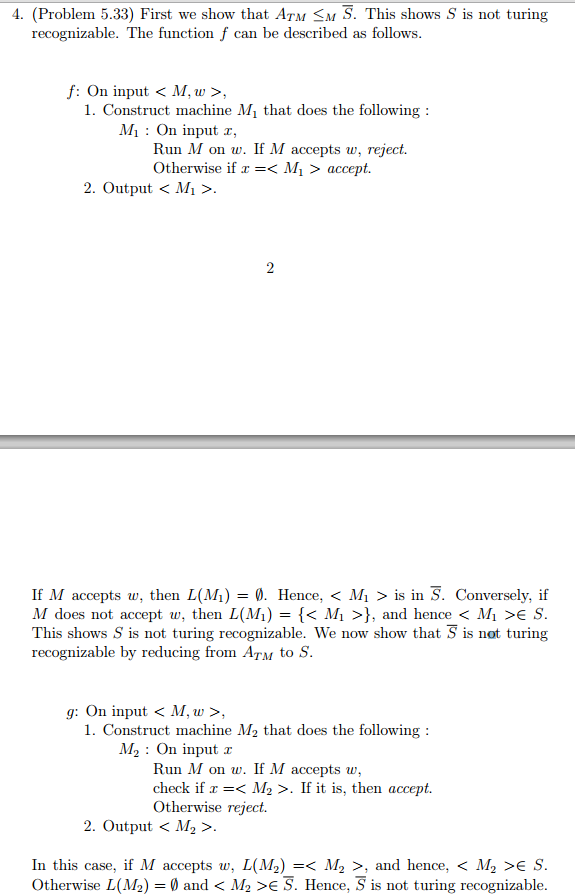

-----

### 5.34
- [ref](http://www.cs.uml.edu/~kdaniels/courses/304_F09/HW8_Solutions.pdf)

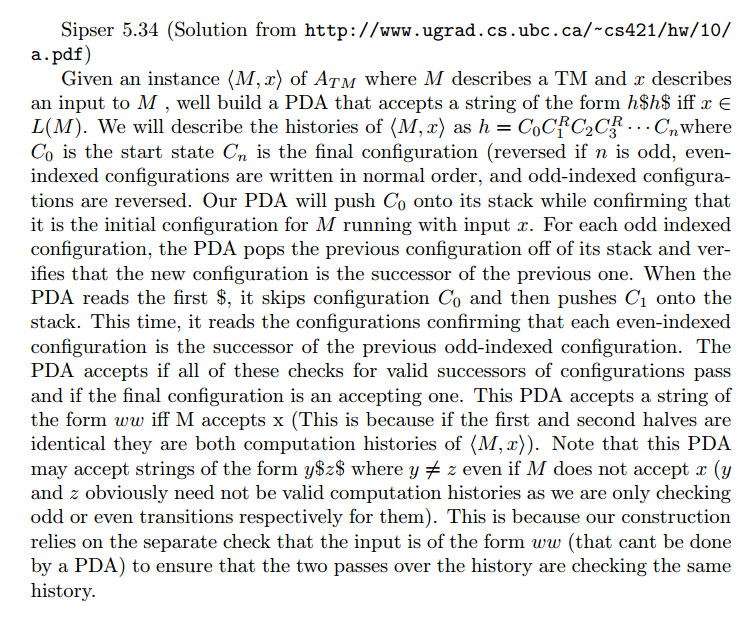

-----

### 5.35
- [ref](http://homepage.cs.uiowa.edu/~sriram/131/spring07/homework2Solution.pdf)

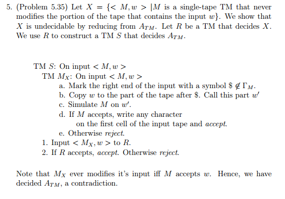

-----
