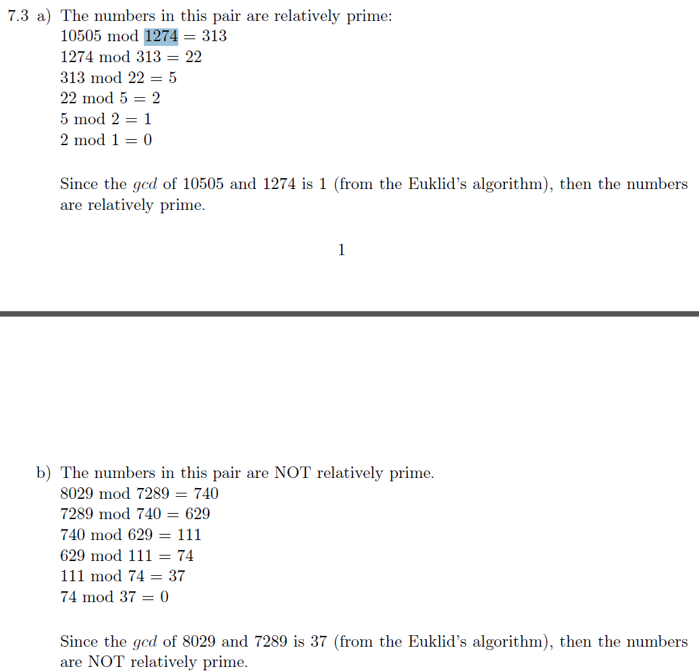
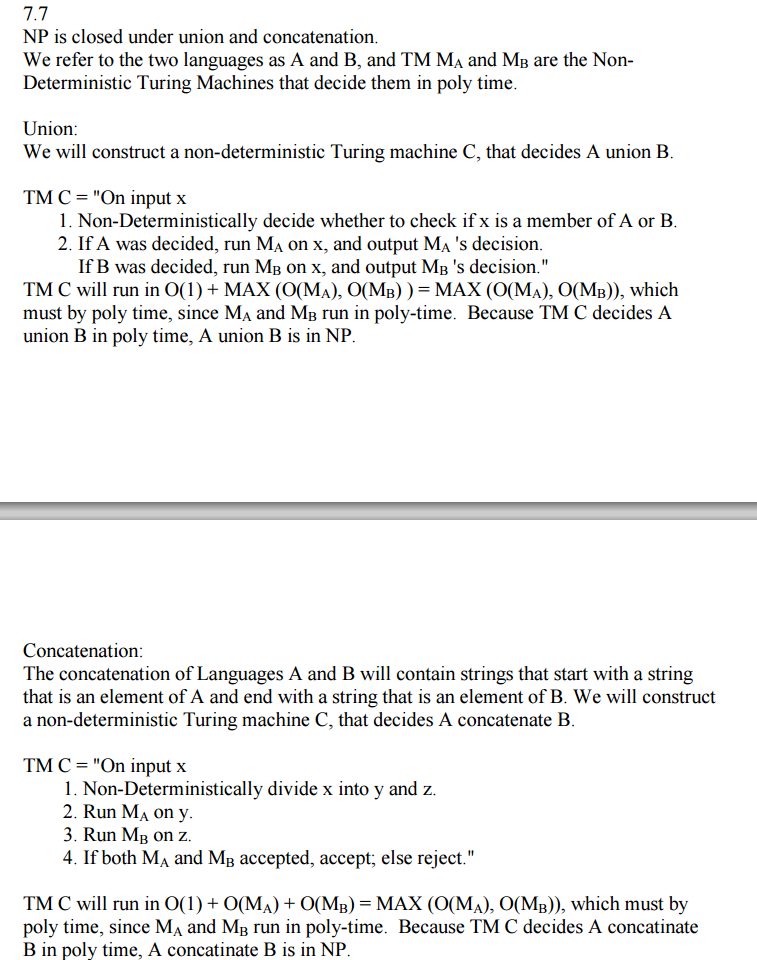

## Chap 7: Time Complexity

### Homeworks
#### 7.24
- [ref](http://people.cs.nctu.edu.tw/~sctsai/fc/hw/hw6_sol.pdf)

----

#### 7.26
- [ref](https://github.com/sstephens/sstephens1/blob/master/dev/comp_theory/asst8/asst8c.tex)
- My answer:
  - create a card for each variable, for a varianble x
    - if the i-th clause contains x, then we have no holes in the left position in the i-th row, otherwise, we punch a hole;
    - if the i-th clause contains negative x, then we have no holes in the right position, otherwise, we punch a hole in the right position.
  - create an additional cards with all left rows punched with holes.
  - the SAT is satisfiable iff the bottom of the box canbe completed covered.
  - Note: a hole is covered indicates a clause is satisfied.
  
----

#### 7.27
- [ref](http://cgi.csc.liv.ac.uk/~igor/COMP309/3CP.pdf)

----

#### 7.28

----

---

### Non-Homeworks
#### 7.3

#### 7.6
- [ref](http://cseweb.ucsd.edu/classes/fa01/cse105_B/hw3ans.pdf)

#### 7.7
- [ref](http://cseweb.ucsd.edu/classes/fa01/cse105_B/hw3ans.pdf)

#### 7.9
- [ref](https://web.njit.edu/~marvin/cs341/hw/hwsoln11.pdf)

#### 7.10
- [ref](http://math.stackexchange.com/questions/28194/how-to-show-that-all-dfa-is-in-p)
- [ref1](https://sites.google.com/site/drriggsnewsite/classlist/cot5310summer2010/assg-9)

#### 7.11
- [ref](http://web.cse.ohio-state.edu/~lrademac/Sp15_6321/ps4sol.pdf)

---

#### 7.12
- [ref](http://people.cs.nctu.edu.tw/~sctsai/fc/hw/hw6_sol.pdf)

----

#### 7.14
- [ref](http://tuvalu.santafe.edu/~moore/theory/homework5solutions.pdf)

----

#### 7.16
- [ref](http://www.cs.virginia.edu/~evans/cs3102-s10/ps/ps6/ps6-comments.pdf)

----

#### 7.17
- [ref](http://www.cs.berkeley.edu/~luca/cs172-07/solutions/sol6.pdf)
- [ref1](http://people.cs.aau.dk/~srba/courses/tutorials-CC-10/t12-sol.pdf)

----

#### 7.19
- [ref](http://www.phil.uu.nl/logcom/jaar/2011-2012/aantekeningen/uitwerkingen-opgaven-sipser.pdf)

----

#### 7.20
- [a](https://web.njit.edu/~marvin/cs341/hw/hwsoln13.pdf)
- [b](http://www.phil.uu.nl/logcom/jaar/2011-2012/aantekeningen/uitwerkingen-opgaven-sipser.pdf)

----

#### 7.21
- [ref](ftp://ftp.cis.upenn.edu/pub/cis511/public_html/Spring07/sol5.pdf)

----

#### 7.23
- [ref](http://www.phil.uu.nl/logcom/jaar/2011-2012/aantekeningen/uitwerkingen-opgaven-sipser.pdf)

---

#### 7.29

#### 7.30
- [ref](http://vorsgald.livejournal.com/39051.html)

----

#### 7.32
- [ref](http://www.cs.nthu.edu.tw/~wkhon/assignments/assign5ans.pdf)

----

#### 7.33
- [ref](http://www.cs.berkeley.edu/~luca/cs172-07/practice2-sol.pdf)

----

#### 7.34
- confused!
- [ref](https://people.cs.umass.edu/~barring/cs311/exams/finpracsol.html)

----

#### 7.35
- confused!
- [ref](http://www.cs.nthu.edu.tw/~wkhon/assignments/assign5ans.pdf)

----

#### 7.36
- confused!
- [ref](http://cs.brown.edu/courses/gs019/asgn/hw4.sol.pdf)

----

#### 7.37
- confused!
- [ref](http://ezekiel.vancouver.wsu.edu/~cs516/final/exam/2009/final-soln.pdf)

----

#### 7.39
- [ref](http://www.csie.ntu.edu.tw/~b92043/homework/%E4%B8%89%E5%B9%B4%E7%B4%9A/automata/s8.pdf)

----

#### 7.40
- [ref](http://www.cs.nthu.edu.tw/~wkhon/assignments/assign5ans.pdf)

----

#### 7.41
- [ref](http://ezekiel.vancouver.wsu.edu/~cs516/final/exam/final-soln.pdf)

----

#### 7.42
- [ref](http://www.dei.unipd.it/~geppo/AA/DOCS/2SAT.pdf)

#### 7.44
- [ref](http://soltys.cs.csuci.edu/blog/wp-content/oldpage/se4i03-f05/test4.pdf)
- [ref1](http://web.cse.ohio-state.edu/~lrademac/Sp15_6321/ps4sol.pdf)

----

#### 7.45
- [ref](https://www.cs.princeton.edu/courses/archive/fall03/cs487/hw7sol.pdf)
- need discussion

#### 7,47
- [ref](http://math.stackexchange.com/questions/84040/does-dtimeon-regular)
