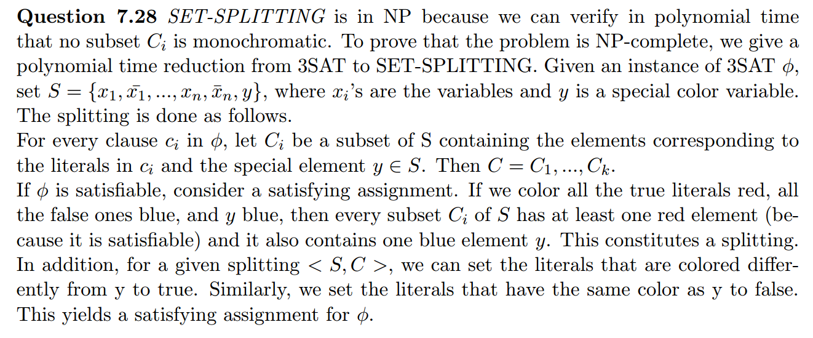

## Chap 7: Time Complexity

### Homeworks
#### 7.24
- [ref](http://people.cs.nctu.edu.tw/~sctsai/fc/hw/hw6_sol.pdf)

----

#### 7.26
- [ref](https://github.com/sstephens/sstephens1/blob/master/dev/comp_theory/asst8/asst8c.tex)
- My answer:
  - create a card for each variable, for a varianble x
    - if the i-th clause contains x, then we have no holes in the left position in the i-th row, otherwise, we punch a hole;
    - if the i-th clause contains negative x, then we have no holes in the right position, otherwise, we punch a hole in the right position.
  - create an additional cards with all left rows punched with holes.
  - the SAT is satisfiable iff the bottom of the box canbe completed covered.
  - Note: a hole is covered indicates a clause is satisfied.
  
----

#### 7.27
- [ref](http://cgi.csc.liv.ac.uk/~igor/COMP309/3CP.pdf)

----

#### 7.28

----

---

### Non-Homeworks
#### 7.3

#### 7.6
- [ref](http://cseweb.ucsd.edu/classes/fa01/cse105_B/hw3ans.pdf)

#### 7.7
- [ref](http://cseweb.ucsd.edu/classes/fa01/cse105_B/hw3ans.pdf)

#### 7.9
- [ref](https://web.njit.edu/~marvin/cs341/hw/hwsoln11.pdf)

#### 7.10
- [ref](http://math.stackexchange.com/questions/28194/how-to-show-that-all-dfa-is-in-p)
- [ref1](https://sites.google.com/site/drriggsnewsite/classlist/cot5310summer2010/assg-9)

#### 7.29

#### 7.30
- [ref](http://vorsgald.livejournal.com/39051.html)
