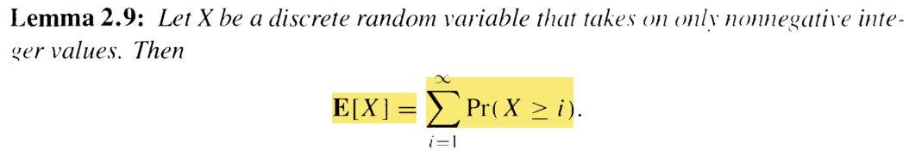

## Chap2 Discrete Random Variables and Expectation

- reading status: current[18-28]/all[18-38]

### Contents
- Definition
    - sample space
    - expectation
- Linearity of expectation
    - application: calculating the expectation of Bernoulli random variable
- Jensen's inequality
    - for any convex function f, if you connect two points on the graph of the function by a straight line, this line on or above the graph of the function
- Property of expectation
    

    
    

- Geometric random variables
    - memoryless

### Trick
- calculating the expectation of a random variable
    - can break the random variable into a sum of some random variables, if the other ramdom variables could be *geometric random varaibles* etc, i.e., have property that can be use directly. Check page-33 for details.
    
### Question
- page-24: Taylor's theorem
- page-29: why the value of z_k in independent of y_(i-1)

