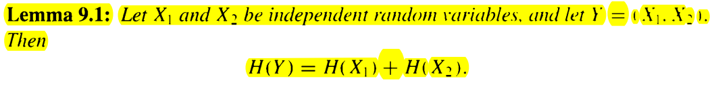
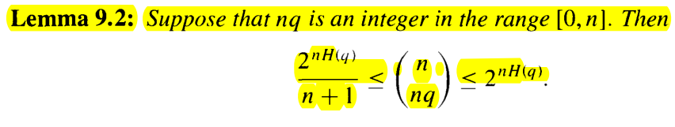

## Entropy, Randomness and Information

- reading status: ing 10/09/2014

### Contents
- definition of entropy
    - interpretation: if we flip a biased coin with p =3/4 to get head, then we obtain H(3/4) random bits each time we flip this coin
- sum of entropy
    

        
    

- entropy and bino
    

        
    

### Questions
